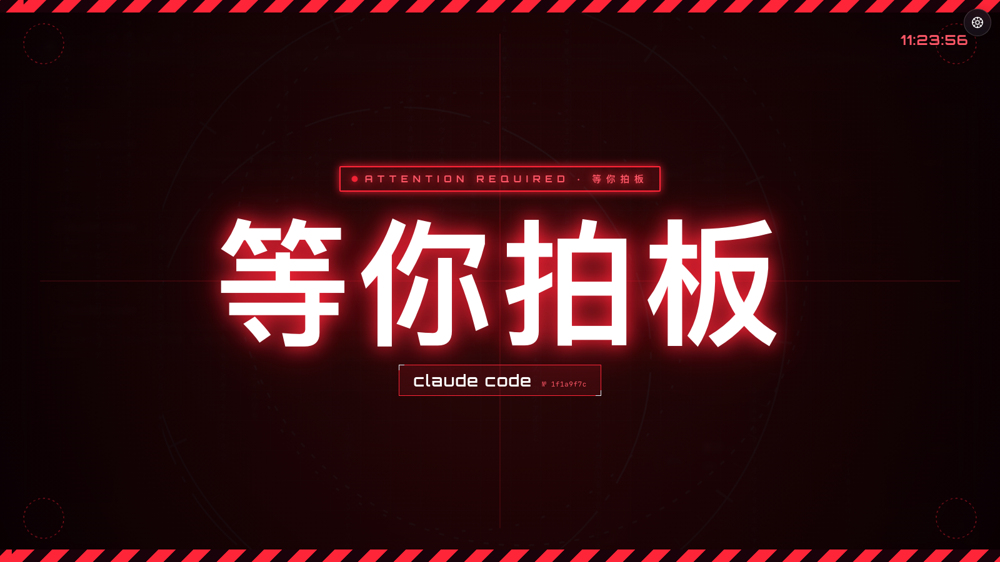

# claude-status

> A live status dashboard for Claude Code sessions, with 7 ambient themes.
> See what every running session is doing — from your iPad on the couch.

[](https://opensource.org/licenses/MIT)
[]()
[]()

**[中文文档 →](README.zh-CN.md)**

---

## What it does

When you run multiple Claude Code sessions, the terminal is the only place you can see what's going on. `claude-status` turns that invisible state into a live dashboard you can watch from any device on your network:

- **Per-session state** — working / thinking / awaiting input / done / idle
- **Current tool & target** — `Bash node script.js`, `Edit src/foo.py`, etc.
- **Token telemetry** — today / this month / all-time, with cache-hit rate
- **Sticky "awaiting input" overlay** — when Claude calls `AskUserQuestion`, the full-screen overlay stays visible until you actually reply (no flashing)
- **7 themes** — pick one that fits your mood, swap any time

It runs a local Python HTTP server (zero dependencies beyond stdlib + `jq`), driven by Claude Code's hook system. State updates are debounced via a tiny shell script.

## Screenshots

| Theme | Vibe |
|---|---|
| [`aurora`](docs/screenshots/aurora.png) | Glassy gradient, calm |
| [`garden`](docs/screenshots/garden.png) | Plants, day/night sky |
| [`glass`](docs/screenshots/glass.png) | Frosted glass, minimal |
| [`jarvis`](docs/screenshots/jarvis.png) | Iron Man HUD |
| [`lab`](docs/screenshots/lab.png) | Lab notebook, specimens |
| [`press`](docs/screenshots/press.png) | Newspaper masthead |
| [`stage`](docs/screenshots/stage.png) | Concert stage, lasers |

<p align="center">
  
</p>

---

## Install

**1. Clone into `~/.claude/status/`** (the hook scripts assume this path):

```bash
git clone https://github.com/Zackzhang229152619/claude-status.git ~/.claude/status
```

**2. Wire the hooks into Claude Code** by merging [`examples/settings.json`](examples/settings.json) into `~/.claude/settings.json`.

Quick check after merging:
```bash
echo '{"session_id":"test","hook_event_name":"PreToolUse"}' | bash ~/.claude/status/update.sh working
cat ~/.claude/status/current.json   # should now show {"global_state":"working", ...}
```

**3. Start the server** (one-off test):
```bash
bash ~/.claude/status/start_server.sh
# then visit http://localhost:8765/ from any device on the LAN
```

**4. Auto-start at login (recommended)** — copy and edit the LaunchAgent template:
```bash
sed "s/YOUR_USERNAME/$USER/g" \
  ~/.claude/status/examples/com.example.claude-status-server.plist \
  > ~/Library/LaunchAgents/com.example.claude-status-server.plist
launchctl load ~/Library/LaunchAgents/com.example.claude-status-server.plist
```

Server logs go to `~/.claude/status/server.log`.

---

## Usage

Open `http://<your-mac-ip>:8765/` on any device. You'll see the default theme — click the gear (top-right) to switch.

The dashboard polls `current.json` once a second and `token_stats.json` every five seconds — no websockets, no service worker, no JS framework. Everything is one Python file + one shell script + seven inline HTML templates.

### State flow

| Hook event | Writes state | Meaning |
|---|---|---|
| `PreToolUse` (any tool) | `working` | Claude is running a tool |
| `PreToolUse` (`AskUserQuestion`) | `needConfirm` | Claude asked you a question |
| `PostToolUse` | `thinking` | Tool returned, Claude is reasoning |
| `UserPromptSubmit` | `thinking` | You just hit Enter |
| `Notification` | `needConfirm` | macOS-level notification (e.g. permission prompt) |
| `Stop` | `done` | Claude finished a turn |

The `global_state` shown at the top of the dashboard is the highest-priority state across all live sessions:
```
needConfirm > working > thinking > done > idle
```

### The sticky `needConfirm` rule

The classic problem: Claude calls `AskUserQuestion`, the dashboard briefly flashes "awaiting input", then `PostToolUse` fires *immediately* (because the tool returned), the state gets overwritten to `thinking`, and you missed the alert.

`update.sh` v1.3 fixes this:

> While a session's state is `needConfirm`, only a `UserPromptSubmit` hook
> (i.e. you actually replying) can clear it. Other hooks that try to overwrite
> the state with `thinking` / `working` / `done` get coerced back to
> `needConfirm`.

The overlay stays visible until you reply.

---

## Architecture

```
┌────────────────────────────────────────────────────────────┐
│  Claude Code (terminal)                                    │
│        │ hook fires                                        │
│        ▼                                                   │
│  update.sh  ──writes──>  ~/.claude/status/current.json     │
└────────────────────────────────────────────────────────────┘
                │ (file on disk)
                ▼
┌────────────────────────────────────────────────────────────┐
│  server.py (localhost:8765)                                │
│    GET /                       → dashboard.html            │
│    GET /current.json           → current.json (1s cache)   │
│    GET /sessions_detail.json   → parses transcript on the  │
│                                  fly (1s cache)            │
│    GET /token_stats.json       → walks ~/.claude/projects/ │
│                                  for usage (5s cache)      │
└────────────────────────────────────────────────────────────┘
                │
                ▼
       browser on any LAN device
```

`dashboard.html` is a single self-contained HTML file. The 7 themes live in
`variants/*.html`; the `scripts/rebuild_dashboard.py` build step inlines them
plus `variants/_common.js` into one `<script id="themes-templates">` JSON
block, so the dashboard works even without network access to sibling files.

## Files

| File | Purpose |
|---|---|
| [`server.py`](server.py) | The HTTP server (Python stdlib only) |
| [`update.sh`](update.sh) | Hook entry point — writes `current.json` |
| [`dashboard.html`](dashboard.html) | The shell + theme picker (380 KB, fully self-contained) |
| [`variants/_common.js`](variants/_common.js) | Polls JSON endpoints, dispatches `onState` / `onTokens` to themes |
| [`variants/{theme}.html`](variants/) | Per-theme markup, CSS, render function |
| [`scripts/rebuild_dashboard.py`](scripts/rebuild_dashboard.py) | Re-bundle `dashboard.html` after editing themes |
| [`examples/settings.json`](examples/settings.json) | Claude Code hook config snippet |
| [`examples/com.example.claude-status-server.plist`](examples/com.example.claude-status-server.plist) | macOS LaunchAgent template |
| [`start_server.sh`](start_server.sh) | LaunchAgent wrapper (finds python3) |

## Customise a theme

Each theme is one self-contained HTML file with `<style>` + `<script>` + a `_common.js`-style `onState(current, detail) / onTokens(tok)` render contract.

1. Copy any `variants/{theme}.html` to `variants/mytheme.html`
2. Add an entry to `<script id="themes-data">` in `dashboard.html` (id / name / desc / swatch CSS gradient)
3. Run `python3 scripts/rebuild_dashboard.py` to inline it into the picker
4. Reload — your new theme shows up in the picker

## FAQ

**Does it work on iPad / iPhone?** Yes. The dashboard is responsive (mobile breakpoint at 820 px) and the polling is plain `fetch()`. Both iOS Safari and Chrome work.

**Does it need a cloud server?** No. By default everything runs on `localhost:8765`. If you want to view it from outside your LAN, point an nginx reverse proxy / Tailscale / Cloudflare Tunnel at the port — that's outside this repo's scope.

**What about privacy?** Everything stays on your Mac. The dashboard only reads files under `~/.claude/` and exposes them over HTTP on `localhost`. Don't expose `:8765` to the public internet without an auth layer in front of it.

**How do I add my own state colors?** Each theme defines `--c-working` / `--c-thinking` / `--c-done` / `--c-idle` / `--c-confirm` at the top of `<style>`. Override and rebuild.

**The dashboard shows old data after I update a theme.** Run `python3 scripts/rebuild_dashboard.py` to re-bundle, then hard-refresh the browser. The bundled `dashboard.html` has aggressive no-cache `<meta>` headers but local browser caches can still be sticky.

## License

[MIT](LICENSE) — do whatever you want with it.
